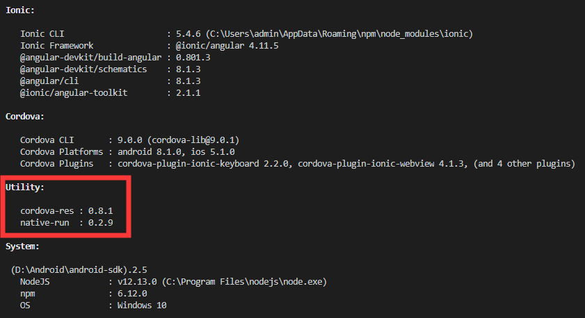

## ionic 真机调试
(以下环境安装最新版即可)
1. java sdk 安装并配置环境
2. android sdk 安装并配置环境
3. gradle 安装并配置环境

## Ionic Info
    ionic info

## 运行命令
    cordova platform remove android/ios
    cordova platform add android/ios
    ionic cordova build/run android/ios

## 真机调试
开发者选项 --> USB调试 --> (某些手机还需要打开USB安装)