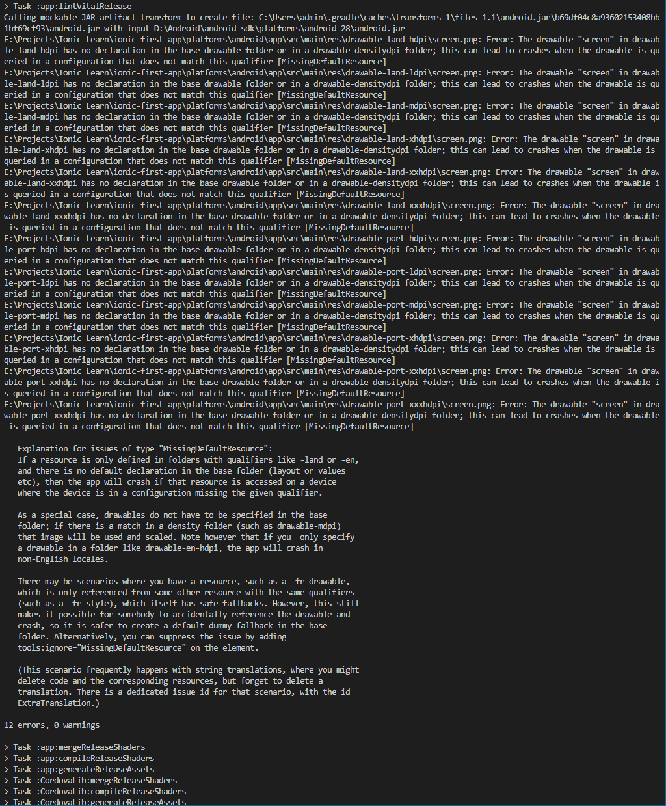
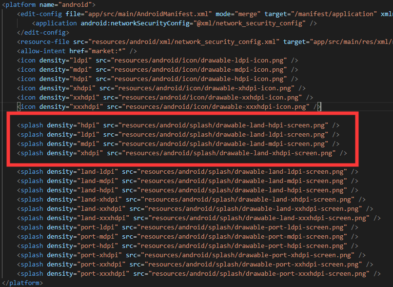
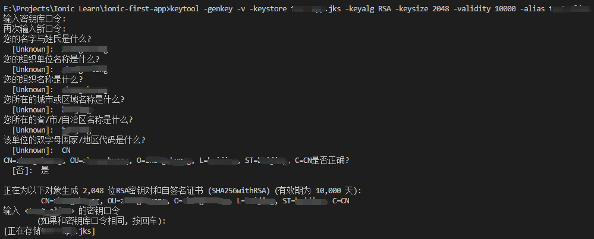

## ionic 真机调试

(以下环境安装最新版即可)

1. java sdk 安装并配置环境

2. android sdk 安装并配置环境

3. gradle 安装并配置环境

## Ionic Info

    ionic info

运行上面的命令，如果发现红框的两个未安装，使用 `npm install` 将其安装

## 运行命令

    cordova platform remove android/ios
    cordova platform add android/ios
    ionic cordova run android/ios

## 真机调试

开发者选项 --> USB调试 --> (某些手机还需要打开USB安装)

## 再按一次退出应用

[物理返回两次，退出应用](https://blog.csdn.net/weixin_42959829/article/details/102909741)

## 打包

### debug版

    ionic cordova build android --prod (app 体积小, 打包时间长)
    ionic cordova build android (app 体积大, 打包时间短)

### 发布版

    ionic cordova build android --prod --release (生成未签名版)

打包过程中如果图片中的报错：

解决方法：打开 `config.xml` 文件添加如下代码

## 签名步骤

### 创建私钥

    keytool -genkey -v -keystore [自定义密钥文件名，如 my-app].jks -keyalg RSA -keysize 2048 -validity 10000 -alias [自定义app别名，如my-alias]

将 xxx.jks 与 android-release-unsigned.apk 放到同一目录下，执行如下命令：

    jarsigner -verbose -sigalg SHA1withRSA -digestalg SHA1 -keystore [上步生成的xxx.jks] app-release-unsigned.apk [上部设置的app的别名]

### 优化apk

进入到 Android SDK 文件夹中的 `build-tools/29.0.2` 下，将已签名的 app-release-unsigned.apk 放入，在该目录中执行如下命令:

    zipalign -v 4 app-release-unsigned.apk [自定义最终生成的app的名字.apk]

